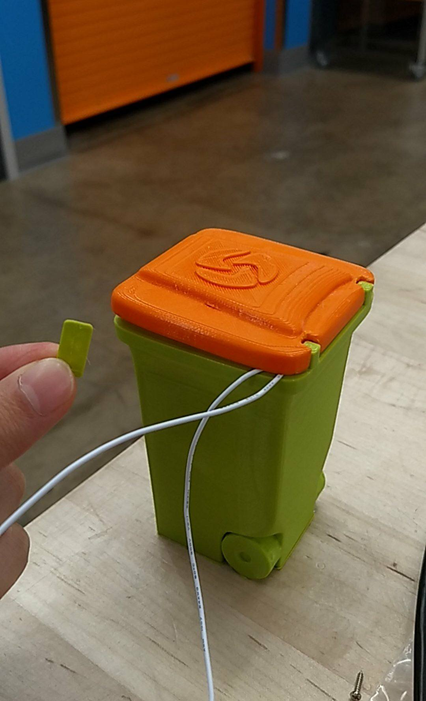
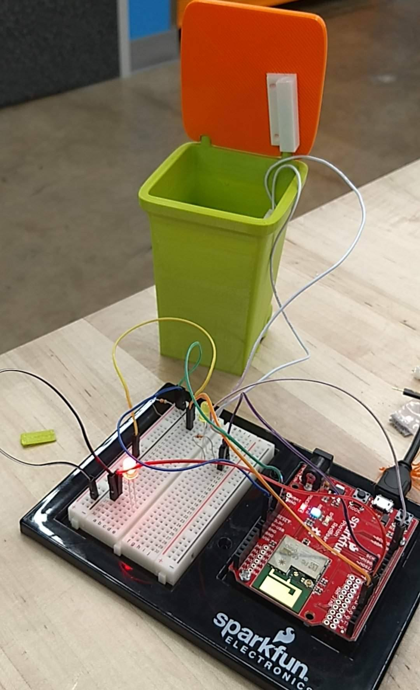

# Midterm IoT Project

Name:  Tracy Lu 

Date: 10/13/2017

## Project: E-waste Impact Awareness

### Conceptual Description

This project explores the concept of e-waste. People usually don't think much of their electronic waste because nowadays it seems like a normal part of life and tossing things in a trashcan is a small motion. However, the there are short and long term amplifications on the environment across more places than people think about. The short term effect that everyone sees is the pile of trash or the annoyance caused by the space that the waste takes up. The long term effect is in the landfills, the labor that goes into dealing with the trash, and the chemical, air, water, and soil pollution this creates. The "buddy photon" represents the landfills, labors, and pollution. More specifically the buddy photon represents economically underpriveleged areas that are exposed to these landfill effects. Eventually when these effects do come back to the original, priveleged areas of the nation, but in a more intense and less delayed fashion. 

### Form

The physical form that the project embodies is the trashcan. Due to the constraints of the on-campus 3D printers, my trashcan print ended up of this size and color, but it symbolizes a normal, large trashcan that dumpster trucks pick up on the side of the street, and is capable of opening and closing similarly to those types of trashcans.

**Finished Enclosure:**



**Electronics Exposed:**



### Technical Details
//   
List of Hardware used: 
* ABS Plastic (3d print)
* Magnetic reed sensors
* Leds
* resistors
* wires
//

Explanation of Code:


```
String lightMode;
int ledPin = 5;
int ledPinb = 7;// choose the pin for the LED
int switchPin = 3;   // choose the input pin (for a pushbutton)
int val = 0;     // variable for reading the pin status

void setup() {
  pinMode(ledPin, OUTPUT);  // declare LED as output
  pinMode(switchPin, INPUT);
  digitalWrite(switchPin, HIGH);
  Particle.subscribe("patricia_tracy_pmt15_tl177", blinkLight);
}

void blinkLight(const char *event, const char *data) {
      lightMode = data;
      pinMode(ledPinb, OUTPUT);
      if(lightMode == "yes"){
digitalWrite(ledPinb, HIGH);
delay(1000);                  // waits for a second
  digitalWrite(ledPinb, LOW);
}

else{
digitalWrite(ledPinb, LOW);}
}

void loop(){
  if(digitalRead(switchPin) == HIGH){
      digitalWrite(ledPin, HIGH);
      Particle.publish("patricia_tracy_pmt15_tl177_b", "cloud");
      delay(2000);
}

else{
digitalWrite(ledPin, LOW);}
}
```

but also link to your project's full code in this repository:  [photon.ino](magnetsensor.ino)

**Wiring Diagram**


